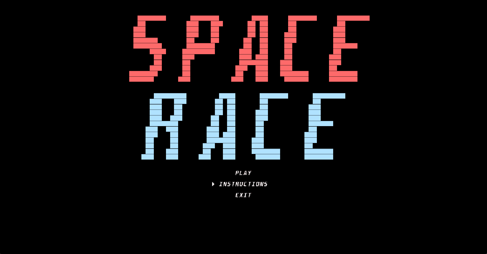
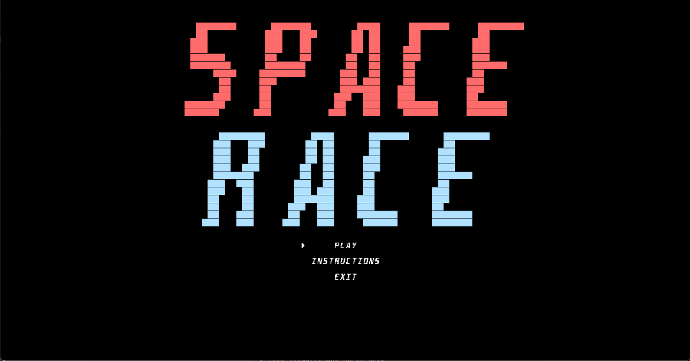

# LDTS_T15_G06 - SPACE RACE

## Game Description

In a race against your opponent you have to reach the top to score points. Along the way you can´t collide with the obstacles.
If you score more points that your opponent, before the time runs out, you win!

This project was developed by Hugo Castro (up202006770@fe.up.pt) and Luís Paiva (up202006094@fe.up.pt) for LDTS 2021/2022.

For a more detailed version of this description click [here](./docs/README.md).

### Game Preview

  

## Menu 

  

