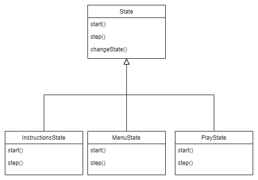
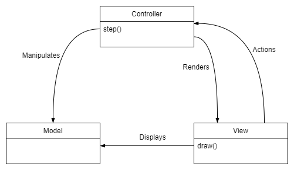
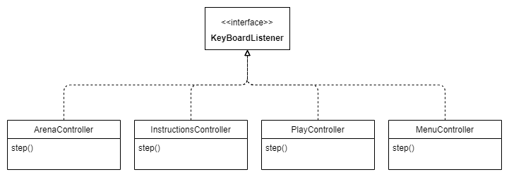
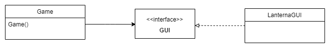
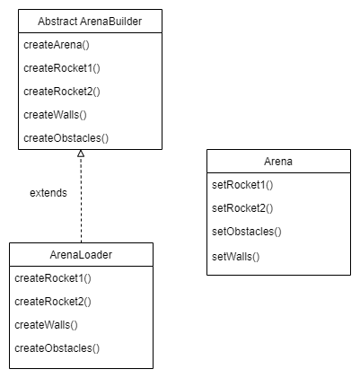

# LDTS_T15_G06 - SPACE RACE

## Game Description

In a race against your opponent you have to reach the top to score points. Along the way you can´t collide with the obstacles.
If you score more points that your opponent, before the time runs out, you win!

This project was developed by Hugo Castro (up202006770@fe.up.pt) and Luís Paiva (up202006094@fe.up.pt) for LDTS 2021/2022.

## Implemented Features

- **Moving Up** - The rocket number 1 will move up when 'w' is pressed, and the rocket number 2 will move up when Arrow Up is pressed.

- **Moving Down** - The rocket number 1 will move down when 's' is pressed and the rocket number 2 will move down when Arrow Down is pressed.

- **Movement of the obstacles** - Obstacles move only horizontally and when they collide with the end of the Lanterna, they change direction.

- **Colisions with obstacles** - When any rocket is in the same position of an obstacle, the rocket will return to the initial position.

- **Points** - Points will be increased when one rocket reach the top and the user can see your score in the Lanterna screen.

- **Menu** - Menu with the options (Play, Instructions,Exit).

- **Time of the game** - A wall represents the time and goes down until the time runs out.

## Planned Features

All the planned features were successfuly implemented.

## Design

#### SWITCH BETWEEN MULTIPLE STATES

**Problem in Context**

The application start in the menu and three options appear. In each option a different thing happen and the actions in there are different.
When instructions option is selected it shows the instructions and then returns to the menu. When play option is selected the game runs and in the end returns to the menu.

**The Pattern**

We used the **State** Pattern. This pattern allowed us to represent different states and switch between those states.
This pattern resolve the identified problems because we create MenuState, PlayState, InstructionsState. 
In the menu when we choose the play option, it switch to the PlayState, when we choose instructions option it switch to the InstructionsState, in both situations at the end switchs back to the menu (MenuState).

**Implementation**

The following figure shows how the pattern's roles were mapped to the application classes.

  

The classes can be found in the following files:

- [MenuState](https://github.com/FEUP-LDTS-2021/ldts-project-assignment-g1506/blob/master/spaceRace/src/main/java/State/MenuState.java)

- [PlayState](https://github.com/FEUP-LDTS-2021/ldts-project-assignment-g1506/blob/master/spaceRace/src/main/java/State/PlayState.java)

- [InstrucionsState](https://github.com/FEUP-LDTS-2021/ldts-project-assignment-g1506/blob/master/spaceRace/src/main/java/State/InstructionsState.java)

**Consequences**

The use of the State Pattern in the current design allows the following benefits:

- Make state transitions explicit.
- We don´t need to have conditional statements associated with the various states. Instead each state activate the right behavior.
- More classes and instances to manage, but there are organized and therefore not difficult to deal with.

#### GENERAL STRUCTURE

**Problem in Context**

Have a way to manage each state and objects in different parts. 

**The Pattern**

We used the **Model-View-Controller** pattern that belongs to **Architectural Patterns**. This pattern allow us to divide the application into three different parts.
So we can control each state and each object in different parts: one works only with its model, another works with the way it is seen and the last one works with the different actions.

**Implementation**
  
  

  
    
The classes can be found in the following files:
    
- [Model](https://github.com/FEUP-LDTS-2021/ldts-project-assignment-g1506/tree/master/spaceRace/src/main/java/model)
    
- [View](https://github.com/FEUP-LDTS-2021/ldts-project-assignment-g1506/tree/master/spaceRace/src/main/java/view)
 
- [Controller](https://github.com/FEUP-LDTS-2021/ldts-project-assignment-g1506/tree/master/spaceRace/src/main/java/controller)

**Consequences**

The use of this pattern int the current design allows the following benefits:

- Easy modification of the entire application.
- Any changes in a certain section of the application will never affect the entire architecture.
- Increase the flexibility and scalability of the application.

#### OBSERVERS AND LISTENERS

**Problem in Context**

In our game, obstacles are always moving, so it is necessary that the game does not stop for users to make inputs.
For this reason, there needs to be a way for the game to always be ready to receive an input.

**The Pattern**

In order to resolve our problem we implemented the **Observer** pattern an **Behavioural Pattern**. This pattern allow us to have an observer, in this case, a keyboard observer.
This mechanism notify multiple objects about any events that happen to the object they are observing.

**Implementation**
    
  

  
    
The classes can be found in the following files:

- [KeyBoardObserver](https://github.com/FEUP-LDTS-2021/ldts-project-assignment-g1506/blob/master/spaceRace/src/main/java/gui/KeyBoardObserver.java)
    
- [ArenaController](https://github.com/FEUP-LDTS-2021/ldts-project-assignment-g1506/blob/master/spaceRace/src/main/java/controller/ArenaController.java)
    
- [MenuController](https://github.com/FEUP-LDTS-2021/ldts-project-assignment-g1506/blob/master/spaceRace/src/main/java/controller/MenuController.java)
    
- [PlayController](https://github.com/FEUP-LDTS-2021/ldts-project-assignment-g1506/blob/master/spaceRace/src/main/java/controller/PlayController.java)
    
- [Instructionscontroller](https://github.com/FEUP-LDTS-2021/ldts-project-assignment-g1506/blob/master/spaceRace/src/main/java/controller/InstructionsController.java)
    
**Consequences**

- Abstract coupling between subject and observer.
- Clean code.
- Organization improved.

#### GUI

**Problem in Context**

In our program we constantly need to draw the objects and it is important to easly access and change the code. The lanterna library have the right tools to make this job, so we must make this library connect with each object.

**The Pattern**

We used the **Facade** pattern, this pattern provides a simple interface to a complex subsystem which contains lots of moving parts, including only the most important functions.

**Implementation**
    
  

  
    
The classes can be found in the following files:

- [GUI](https://github.com/FEUP-LDTS-2021/ldts-project-assignment-g1506/blob/master/spaceRace/src/main/java/gui/GUI.java)
    
- [LanternaGUI](https://github.com/FEUP-LDTS-2021/ldts-project-assignment-g1506/blob/master/spaceRace/src/main/java/gui/LanternaGUI.java)

**Consequences**

- Minimizes complexity of sub-systems.
- Aids principle of loose coupling.
- Expand lanterna funcionalities.

#### ARENA BUILDER

**Problem in Context**

The action of the game takes place in an arena, which contains rockets, obstacles and a wall. All this elements have to be created and set into the arena. The proccess has to be divided and organized into diferent parts.

**The Pattern**
**Factory Method** is a creational design pattern that provides an interface for creating objects in a superclass, but allows to alter the type of objects that will be created. **Builder** pattern is also a creational pattern that lets you construct complex objects step by step.

**Implementation**
      
  

  
    
The classes can be found in the following files:
    
- [ArenaBuilder](https://github.com/FEUP-LDTS-2021/ldts-project-assignment-g1506/blob/master/spaceRace/src/main/java/model/Arena/ArenaBuilder.java)
    
- [ArenaLoader](https://github.com/FEUP-LDTS-2021/ldts-project-assignment-g1506/blob/master/spaceRace/src/main/java/model/Arena/ArenaLoader.java)
    
- [Arena](https://github.com/FEUP-LDTS-2021/ldts-project-assignment-g1506/tree/master/spaceRace/src/main/java/model/Arena)

**Consequences**

- Allows the sub-classes to choose the type of objetcs to create.
- It promotes the loose-coupling by eliminating the need to bind application-specific classes into the code.
- Construct objects step by step.

#### KNOWN CODE SMELLS AND REFACTORING SUGGESTIONS

#### *Large Class or Method*
The classes Game, ArenaController contain many fields and the class LanternaGUI contain a lot of methods. In the Classes Game and the class ArenaController, we need to store a lot of data, this is because the Game class is the base of the program and the ArenaController controls what happen inside the the game. In other hand, LaternaGUI need a lot of methods for the interface and it wouldn't make sense to slip it.

#### *Data Class*
All model Classes are Data Classes,as they contain only fields, and no behaviour (dumb classes). This is caused by the arquitectural pattern *MVC* (Model-View-Controller),where the controller is the responsabel to implement the logic functionalities of each model.
For us this is not a bad smell beacuse it only exits due the chosen design pattern.

#### *Refused bequest*
Throughout the code we were creating somo abstract classes to make our project simpler and clear.However, this resulted in a *Refused bequest* smell.
As a result, some classes inherited methods from. The parent class that were not defined or used (e.g Class Play State)

#### *Switch Statements*
In the beginning we start by using the switch statement to move the rockets, to escape and to use the enter key. When we realized the existence of the code smell we changed it to a hash map which made the code simpler.

### TESTING

### Screenshot of coverage report

### Link to mutation testing report

## SELF-EVALUATION

-Hugo Castro: 50%
-Luís Paiva: 50%
